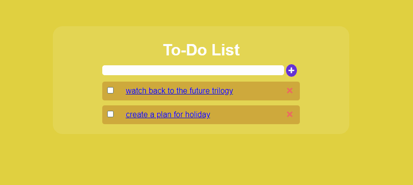
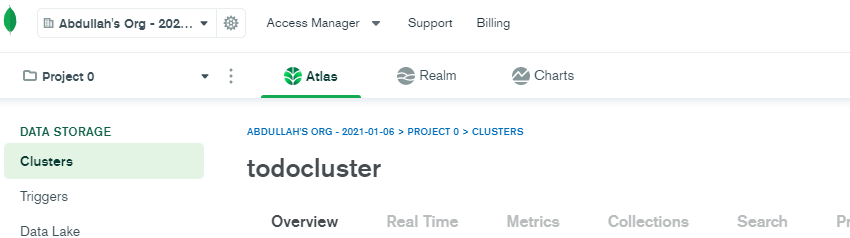
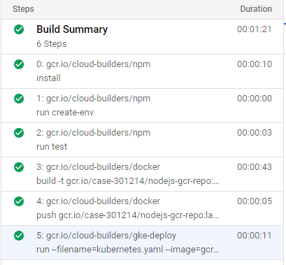
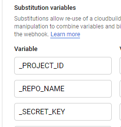
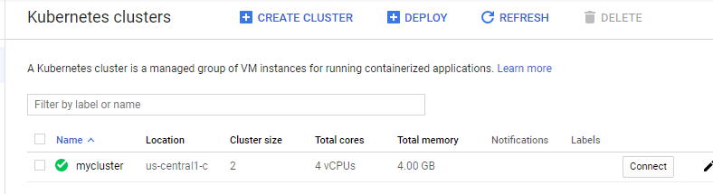
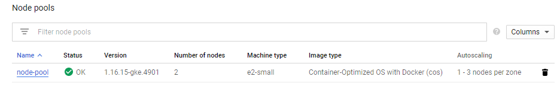
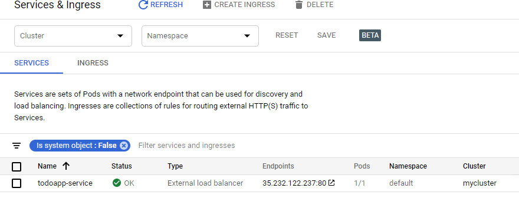
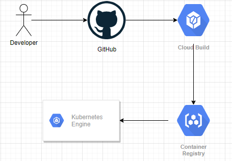

# Simple Todo List NodeJS Web Application CI/CD Pipeline

- The project builds a Kubernetes cluster on a GCP using GKE to run a simple todo list web application written in NodeJS.


 > Tools

- **Github** : Source Code Management
- **CloudBuild** : This is the build server which handle the compiling and building the containers and push it to GCR and deploy to Kubernetes Cluster. Also test cases run here. 
- **GKE** : Kubernetes service provided by GCP. Cluster management is much easier with this service. 
- **GCR** : This is the private registry to manage the pool of our container images.
- **IAM** : You use this service to control who is authenticated (signed in) and authorized (has permissions) to use resources.
- **MongoDB Atlas** : This is the cloud database service for application backend service.          

> App

- Web application written in NodeJS. You need to install npm modules for it work.
- This app is used to create to-do list. You can add, delete and list items.
```python
npm install
```
- I used Express.js module for a minimal and flexible Node.js web application framework. Also used ejs for need to use javascript codes in HTML.

```python
npm install ejs
npm install express
```
### List,Create,Delete Functions
- I wrote as a function for simplicity and used routing.
```javascript
// GET METHOD
app.route("/")
    .get(routings.getToDo)
//POST METHOD
    .post(routings.postToDo);
//DELETE
app.route("/remove/:id")
    .get(routings.deleteToDo)
```
```javascript
function getToDo(req, res) {
    TodoTask.find({}, (err, tasks) => {
        res.render("todo.ejs", { todoTasks: tasks });

    });
}

function postToDo(req, res) {
    const todoTask = new TodoTask({
        content: req.body.content,
        check: true
    });
    try {
        todoTask.save();
        res.redirect("/");
    } catch (err) {
        res.redirect("/");
    }

}

function deleteToDo(req, res) {
    const id = req.params.id;
    TodoTask.findByIdAndRemove(id, err => {
        if (err) return res.send(500, err);
        res.redirect("/");
    });
}
```
- Created dockerfile for dockerize application and then create an image.
### Dockerfile:

```Dockerfile
FROM node:12

WORKDIR /usr/src/app //

COPY package*.json ./

RUN npm update

COPY . .

EXPOSE 8080

CMD [ "npm", "start" ]
```
- FROM node indicates the base image from which the application you are building. In this case we are using the official Image for Node.js.
- WORKDIR defines the working directory of a Docker container.
- COPY instructs Docker to copy files from a specific location in a local file into the Docker image itself. Copy takes in a src and destination.
The package.json file holds metadata relevant to the project and provides information such as a list of modules or dependencies that the application relies on.
- RUN is the command to execute any commands during the building process.
- EXPOSE instructs Docker that the container will be listening on the specified network port at runtime.
- CMD is the command the container executes by default to launch the built image.
> Database

- Used MongoDB Atlas. I used cause of i did not have to set up a database in kubernetes and has a very usefully mongoose package with nodejs. I created Cluster in Cloud and connect to my project with credentials. We kept credentials in .env file at local but  can keep the credentials different place in the cloud. I'll explain in build phase.

> Test

- I used mocha and chai plugins to backend run tests.
 
  - **Mocha** : is a testing library for Node.js, created to be a simple, extensible, and fast.
  - **Chai** and **Should** : is an assertion library used with Mocha.
```python
npm install mocha chai should
```
- For example, we are testing the '/' action function that brings list. If response is 200 and json type, test is passing.
```javascript
describe('/GET todo Lists', () => {
    it('it should GET all the lists', (done) => {
      chai.request(server)
        .get('/')
        .end((err, res) => {

          res.status.should.be.equal(200);

          res.should.be.json;

          done();
        });
    });
  })

});
```

> Pipeline

- Building and deploying code to GKE Cluster with CloudBuild. We used cloudbuild.yaml for managing to the process. There is automatic deployment support for kubernetes environment with Dockerfile in GCP. But tests need to run during the build phase. Therefore used cloudbuild.yaml.

### cloudbuild.yaml:

```yaml
---
  # define the build steps
steps:
  # stage1 install the app dependencies
  - name: 'gcr.io/cloud-builders/npm'
    args: ['install']
  # stage2 create .env file
  - name: 'gcr.io/cloud-builders/npm'
    args: ['run', 'create-env']
    env:
    - 'DB_CONNECT=${_SECRET_KEY}'
  # stage3 execute the tests
  - name: 'gcr.io/cloud-builders/npm'
    args: ['run', 'test']

  # stage4 build an artifact using the docker builder
  - name: 'gcr.io/cloud-builders/docker'
    args: ['build', '-t', 'gcr.io/$_PROJECT_ID/$_REPO_NAME:latest', '.']

  - name: 'gcr.io/cloud-builders/docker'
    args: ['push', 'gcr.io/$_PROJECT_ID/$_REPO_NAME:latest']

  # stage5 deploy container image to GKE
  - name: 'gcr.io/cloud-builders/gke-deploy'
    args:
    - run
    - --filename=kubernetes.yaml
    - --image=gcr.io/$_PROJECT_ID/$_REPO_NAME:latest
    - --location=us-central1-c
    - --cluster=mycluster
  
images:
  - 'gcr.io/$PROJECT_ID/$_REPO_NAME:latest'

```
- **Note**: Before the step, We create cluster, load balancer service and node pool in Kubernetes Engine Service with default configuration by use Console.
- *In stage1* , installed npm modules as needed for run test.
- *In stage2*, we should not push db credentials(.env file) to remote repository. So, we need connect to db for run test and credentials. First of all, Add your env vars to the 'variables' section in one of your build trigger settings.


 Configure cloudbuild.yaml to read in variables from your build trigger, set them as env vars, and write all env vars in a local .env file and then add create-env script to package.json.

```json
"scripts": {
    "start": "nodemon server.js",
    "test": "mocha --exit",
    "create-env": "printenv > .env"
```
Read env vars from .env to your app (server.js)

```json
npm install dotenv
```
```javascript
const dotenv = require("dotenv");
dotenv.config();
```
You  deploy your app by triggering the cloudbuild and your app will have access to the env vars.
- *In stage3*, execute the tests and see result.
- *In stage4*, we tell the Docker to build the image and give it the specified tag -t and push to private GCR service.
- *In stage5*, deploying application with latest docker image to the mycluster using kubernetes.yaml

- Create and deploy application. Run application with my latest   GCR image.
### kubernetes.yaml:
```yaml
---
apiVersion: "apps/v1"
kind: "Deployment"
metadata:
  name: "todoapp"
  namespace: "default"
  labels:
    app: "todoapp"
spec:
  replicas: 1
  selector:
    matchLabels:
      app: "todoapp"
  template:
    metadata:
      labels:
        app: "todoapp"
    spec:
      containers:
      - name: "todoapp"
        image: "gcr.io/case-301214/nodejs-gcr-repo:latest"
        imagePullPolicy: Always
```

> Orchestration

- Push Docker image from CloudBuild to GCR
- Deploy last image in GCR to GKE Cluster using CloudBuild and cloudbuild.yaml

- Application running on 2 node.

- You can access to this link http://35.232.122.237:80


## Pipeline Schema



## My Decisions and Reasons

### Why NodeJS Application?

- It's easy to write and you can handle dependencies with a single command. It's open source, So very easy to find helpful source in web.
### Why CloudBuild?

- Because If I will working on GCP, I prefer gcp build service. CloudBuild is very easy making integration to pipeline. And You managing build and deploy process in one single yaml file. Simplicity is the key.

### Why GKE?

- GKE is covered and will manage all of it for you. Autoscale, networking, manage nodes etc. Automating deployment to GKE is easy too. GKE supports the container format, and makes it simple to store and access your private Docker images. Finally, Google Cloud Platform which also offers 300$ free credit.